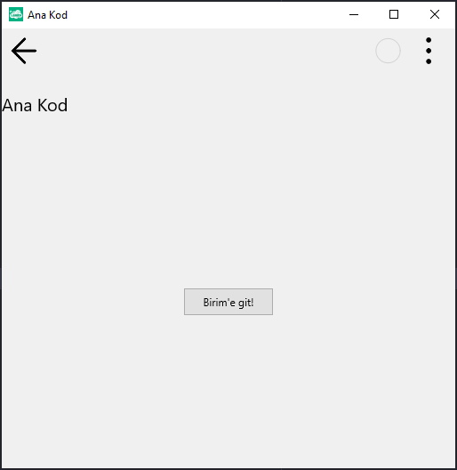

# 13.Bölüm 7.Örnek

### Açıklama

Örnekte, `Form1` üzerinde bir etiket (`LblAnaKod`) ve bir buton (`BtnAnaKod`) oluşturulmuştur. Etiket, formun üst kısmında yer alır ve "Ana Kod" başlığını görüntüler. Etiketin font büyüklüğü 20 olarak ayarlanmış ve yüksekliği 70 piksel olarak belirlenmiştir. Buton ise, kullanıcıya "Birim'e git!" mesajı gösterir ve 100 piksel genişliğe sahiptir. Formun başlığı `clSetCaption('Ana Kod')` ile "Ana Kod" olarak ayarlanmıştır. Form çalıştırıldığında, kullanıcıya bu başlık ve buton gösterilir, ancak butona tıklandığında herhangi bir işlem yapılmaz, çünkü butona bağlı bir etkinlik tanımlanmamıştır.

