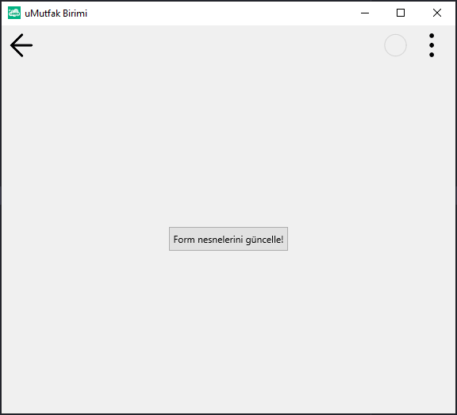

# 13.Bölüm 8.Örnek

### Açıklama

Örnekte, `Form2` üzerinde bir buton (`Button2`) oluşturulmuştur. Buton, kullanıcıya "Form nesnelerini güncelle!" mesajını gösterir ve 150 piksel genişliğe sahiptir. Formun başlığı ise `clSetCaption('uMutfak Birimi')` ile "uMutfak Birimi" olarak ayarlanmıştır. Ancak, butona tıklanması için bir etkinlik tanımlanmamış ve bu nedenle buton herhangi bir işlem gerçekleştirmez. Form çalıştırıldığında, sadece başlık ve buton görünür olacaktır.

