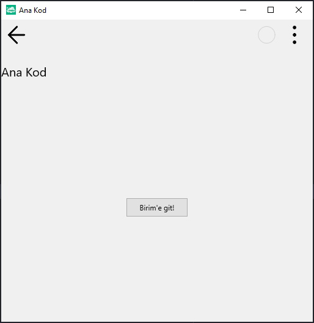

# 13.Bölüm 9.Örnek

### Açıklama

Örnekte, `Form1` üzerinde bir buton (`BtnAnaKod`) ve bir etiket (`LblAnaKod`) oluşturulmuştur. Etiket, "Ana Kod" metnini görüntüler ve üst kısmında hizalanır. Butona tıklandığında, `BirimeGit` adlı bir fonksiyon çalıştırılır. Bu fonksiyon, `Unit1` nesnesinin `UnitName` özelliğini `'uMutfak'` olarak ayarlar ve ardından `Unit1.Run` komutunu çağırarak `'uMutfak'` birimini çalıştırır. Ayrıca, `Unit1.CallerForm` özelliği ile çağrıldığı form (`Form1`) belirtilmiştir. Form başlığı "Ana Kod" olarak ayarlanmış ve butonun metni "Birim'e git!" olarak belirlenmiştir.

