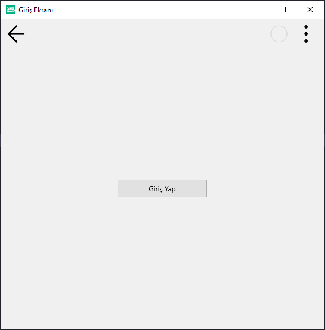
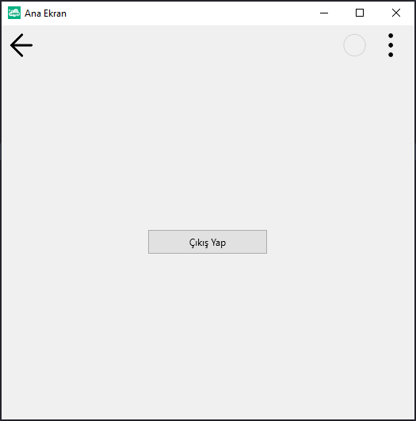

# 13.Bölüm 3.soru

### Açıklama

Birimler Arasında Geçiş Yapma Senaryosu:
* uGirisEkrani: Bu birimde bir "Giriş Yap" butonu oluşturun. Kullanıcı bu butona tıkladığında, giriş yapıldığı varsayılarak "uAnaEkran" birimine geçiş yapılacaktır.
* uAnaEkran: Bu birimde ise, kullanıcıya "Çıkış Yap" butonu sunun. Kullanıcı bu butona tıkladığında, tekrar "uGirisEkrani" birimine dönülecektir.

