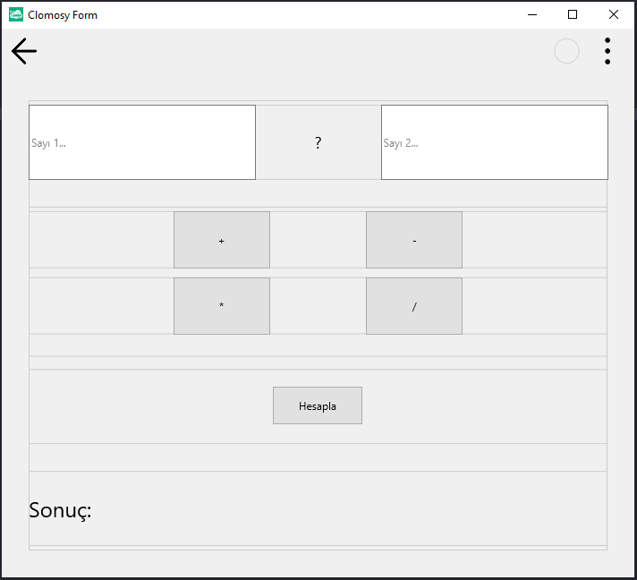
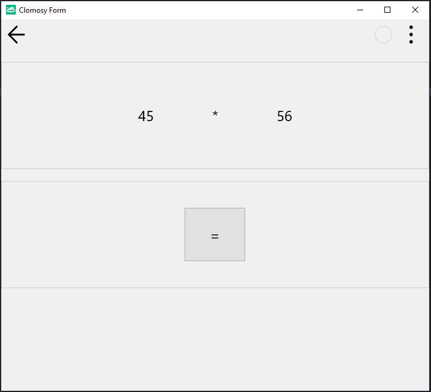

# 13.Bölüm 4.soru

### Açıklama

Bir Matematik İşlemleri Yönetim Uygulaması Oluşturun:

Uygulamanın Amacı: Kullanıcıların temel matematik işlemlerini (+, -, *, /) yapabilmesini sağlayan bir uygulama tasarlanmalıdır. İşlemler bir formda yapılacak ve işlem sonuçları farklı bir birimde görüntülenecektir. Bunun için;
* "Ana Kod" sayfasında 1. ve 2. sayıyı alabilmek için bir TclEdit, operatörü seçebilmek için 4 ayrı TclButton (+, -, *, /), "Hesapla" butonu için TclButton ve sonuç gösterebilmek için TclLabel nesneleri oluşturulacaktır.
* "uHesaplama" adıyla bir birim oluşturulacaktır.
* "Ana Kod" sayfasında kullanıcıdan sayı değerleri ve seçilen operatör alınacak, "Hesapla" butonuna tıklanarak "uHesaplama" sayfasına yönlendirilecektir. Eğer veriler boşsa, kullanıcı diğer sayfaya yönlendirilmemelidir.
* "uHesaplama" biriminde 3 ayrı TclLabel (1. sayı, 2. sayı ve operatörü görüntülemek için) ve hesaplama yapabilmek için TclButton nesnesi oluşturulacaktır.
* "uHesaplama" biriminde "=" butonuna basıldığında, "Ana Kod" sayfasından gelen değerlerle (1. sayı, 2. sayı ve operatör) hesaplama yapılacak ve sonuçla beraber tekrar "Ana Kod" sayfasına yönlendirilecektir.

