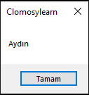

# 3.Bölüm 1.soru

### Açıklama
Yeni bir program yazın ve bir değişken oluşturun. Bu değişkenin adı ‘sehirAdi’ ve veri türü String olsun. ‘sehirAdi’ değişkenine bir değer atayın ve bu değeri ShowMessage ile ekranda gösterin.

