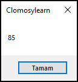

# 3.Bölüm 10.soru

### Açıklama

Bir Para Birimi Hesaplama Sorusu:
* Soru: Yurt dışında tatildeyken 100 ABD Doları bozdurmanız gerekiyor. Ancak, bulunduğunuz ülkede para birimi Euro. Eğer 1 ABD Doları = 0.85 Euro ise, 100 ABD Doları kaç Euro eder?
* Açıklama: Para birimi dönüşümünü uygulayarak ABD Dolarını Euro'ya çeviriniz.

