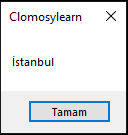
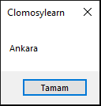

# 3.Bölüm 2.soru

### Açıklama

Değişkenin değerini değiştirmek için bir kod bloğu yazın. Örneğin, ‘sehirAdi’ değişkenine ilk olarak Istanbul değerini atayın ve daha sonra bu değeri Ankara olarak güncelleyin. Güncellenen değeri ekranda gösterin.

