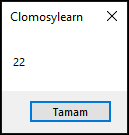
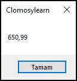
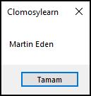
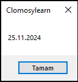

# 3.Bölüm 3.soru

### Açıklama
Aşağıdaki değişkenleri tanımlayınız ve uygun veri türlerini belirleyiniz:

* Bir öğrencinin yaşı (tam sayı), bir kitabın adı (metin)

Her bir değişken için örnek değerler atayınız ve ShowMessage ile ekranda gösteriniz.

