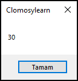

# 3.Bölüm 4.soru

### Açıklama

‘ilkSayi’ ve ‘ikinciSayi’ adında iki tam sayı değişkeni oluşturunuz. Bu değişkenlere sırasıyla 10 ve 20 değerlerini atayınız. Bu iki sayının toplamını hesaplayınız ve sonucu ShowMessage ile ekranda gösteriniz.

