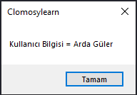

# 3.Bölüm 5.soru

### Açıklama

‘Ad’ ve ‘Soyad’ adında iki metin değişkeni oluşturun. Bu değişkenlere isim ve soy isim değerlerini atayın. Bu iki değişkenin değerlerini birleştirerek tam adı oluşturan ‘AdSoyad’ değişkenine atayın ve ShowMessage ile ekranda ‘Kullanıcı bilgisi = ad + soyad’ olarak gösterin.

