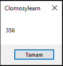

# 3.Bölüm 6.soru

### Açıklama

Bir Sıcaklık Hesaplama Sorusu:
* Soru: Bir tarifte fırını 180°C'de ısıtmanız gerektiği belirtiliyor. Ancak fırınınız Fahrenheit cinsinden dereceleri gösteriyor. Fırınınızı hangi dereceye ayarlamalısınız?
* Açıklama: Sıcaklık dönüşümünü uygulayarak Celsius'tan Fahrenheit'a geçiş yapılır. Formül: F = (C * 9/5) + 32.

