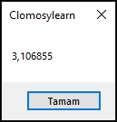

# 3.Bölüm 7.soru

### Açıklama 

Bir Mesafe Hesaplama Sorusu:
* Soru: Bir koşu yarışmasında 5 kilometre koşmanız gerekiyor. Ancak antrenman yaptığınız parkur mil cinsinden ölçülmüş. Parkurunuzun kaç mil olduğunu bilmek istiyorsunuz. 5 kilometreyi mile çevirin.
* Açıklama: Mesafe dönüşümünü uygulayarak kilometreden mile geçiş yapılır. 1 kilometre ≈ 0.621371 mil.

