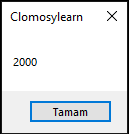

# 3.Bölüm 8.soru

### Açıklama

Bir Hacim Hesaplama Sorusu:
* Soru: Bir içecek tarifi, 2 litre su eklemenizi istiyor. Ancak, ölçüm kabınız sadece mililitre cinsinden ölçümler gösteriyor. 2 litre su kaç mililitredir?
* Açıklama: Hacim dönüşümünü uygulayarak litreyi mililitreye çevirin. 
* 1 litre = 1000 mililitre.

