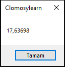

# 3.Bölüm 9.soru

### Açıklama

Bir Ağırlık Hesaplama Sorusu:
* Soru: Bir yemek tarifinde 500 gram un kullanmanız gerekiyor. Ancak, tartınız sadece ons cinsinden ölçüm yapabiliyor. 500 gram un kaç ons eder?
* Açıklama: Ağırlık dönüşümünü uygulayarak gramı onsa çeviriniz.
* 1 gram ≈ 0.03527396 ons

