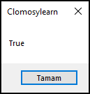

# 4.Bölüm 3.Örnek

### Açıklama

Örnekte, `Kutu1Boyut` ve `Kutu2Boyut` adında iki tamsayı değişkeni tanımlanmıştır ve bu değişkenlerin değerleri karşılaştırılmaktadır. Kodda, `Kutu1Boyut` ve `Kutu2Boyut` her ikisi de 30 olarak belirlenmiş ve bu iki değişkenin eşit olup olmadığı `BoyutlarEsit` adında bir boolean değişkeninde saklanmıştır. Sonuç olarak, `BoyutlarEsit` değeri ekrana yazdırılmaktadır.

