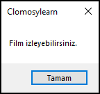

# 4.Bölüm 5.Örnek

### Açıklama

Örnekte, `arkadasGeliyor` ve `icecekVar` adında iki boolean değişken tanımlanmış ve bu değişkenler kullanılarak `filmIzleyebilir` adında bir boolean değer hesaplanmıştır. `arkadasGeliyor` değişkeni **False** (arkadaş gelmiyor) ve `icecekVar` değişkeni **True** (içecek var) olarak atanmıştır. `filmIzleyebilir`, bu iki durumdan en az birinin doğru olup olmadığını kontrol eden mantıksal **veya** (`||`) operatörüyle hesaplanmıştır. Sonuç, bir `if-else` yapısıyla değerlendirilmiş ve film izleme durumu ile ilgili uygun mesaj ekrana yazdırılmıştır.

