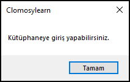

# 4.Bölüm 7.soru

## Açıklama

Bir okulda kütüphaneye giriş yapabilmek için öğrencilerin kimlik kartlarını göstermesi veya öğretmenlerden izin alması gerekiyor. Aşağıda verilen duruma göre, kütüphaneye girip giremeyeceğinizi kontrol eden bir program yazınız. Program, öğrencinin kimlik kartı olup olmadığı ve öğretmen izni durumuna göre ekrana uygun mesajı yazdıracaktır.

Durum:
* Kimlik kartı: Hayır
* Öğretmen izni: Evet

Beklenen Sonuç:
* Program, bu duruma göre "Kütüphaneye girebilirsiniz." veya "Kütüphaneye giremezsiniz." mesajlarından birini ekrana yazdırmalıdır.

