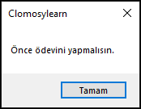

# 5.Bölüm 1.Örnek

### Açıklama

Örnekte, `HavaGuzel` ve `OdevBitmis` adında iki boolean değişken tanımlanmış ve bu değişkenlere bağlı olarak bir dizi koşul değerlendirilmiştir. `HavaGuzel` **True** (hava güzel) ve `OdevBitmis` **False** (ödev bitmemiş) olarak atanmıştır. Kodda, önce hava durumu kontrol edilmekte, eğer hava güzel ise ödevin bitip bitmediği ikinci bir koşul ile değerlendirilmektedir. Hava güzel ve ödev bitmişse "Parka gidebilirsin" mesajı, hava güzel ancak ödev bitmemişse "Önce ödevini yapmalısın" mesajı, hava kötü ise "Hava kötü, parka gidemezsin" mesajı ekrana yazdırılır.

