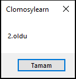

# 5.Bölüm 2.Örnek

### Açıklama

Örnekte, `Derece` adında bir tamsayı değişkeni tanımlanmış ve bu değişkenin değerine göre bir durum kontrolü yapılmıştır. `Derece` değişkeni **2** olarak atanmıştır ve `case` yapısı kullanılarak farklı durumlar için uygun mesajlar ekrana yazdırılmaktadır. Eğer `Derece` 1, 2 veya 3 ise sırasıyla "1. oldu", "2. oldu" veya "3. oldu" mesajları gösterilmektedir. `Derece` bu değerlerin dışında bir sayı olduğunda ise "Dereceye giremedi" mesajı görüntülenir. 

