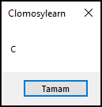

# 5.Bölüm 3.soru

### Açıklama

Bir vize ve final notu belirlenip geçme notunu hesaplayın. Hesaplanan geçme not aralığına göre bir harf döndüren (A, B, C, D, F) programı yazın.

Kurallar:
* Geçme notu: (VizeNotu * 0.4) + (FinalNotu * 0.6) olarak belirleyin.
* Hesaplanan not aralıklarına göre harf notları şu şekilde belirlenir:
	* 90 ve üzeri: A
	* 80 - 89: B
	* 70 - 79: C
	* 60 - 69: D
	* 60’ın altı: F

