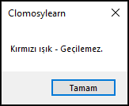

# 5.Bölüm 6.soru

### Açıklama

Bir trafik ışığının durumu, belirlenen bir renk değeriyle kontrol edilecektir. Bu durumu bir if yapısı kullanarak kontrol eden bir program yazınız.

Durumlar:
* "Yeşil ışık" → Geçebilirsiniz.
* "Kırmızı ışık" → Geçilemez.
* "Sarı ışık" → Dikkatli olmalısınız.

