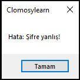

# 5.Bölüm 7.soru

### Açıklama

Bir sisteme giriş yapan kullanıcının adı ve şifresi belirlensin. Eğer kullanıcı adı doğruysa, şifrenin doğruluğu kontrol edilsin. Her ikisi de doğruysa "Giriş yapıldı" mesajı, yanlışsa "Hata" mesajı gösterilsin.

NOT: "KullaniciAdi" ve "Sifre" verileride değişiklikler yapılarak farklı sonuçlar elde edilebilir.

