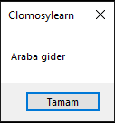
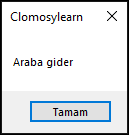
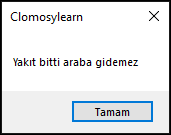

# 6.Bölüm 1.Örnek

### Açıklama

Örnekte, `Benzin` adında bir tamsayı değişkeni tanımlanmış ve bir `while` döngüsü ile kontrol edilmiştir. `Benzin` değişkeni başlangıçta **20** olarak atanmıştır. Kodda, `while` döngüsü ile `Benzin` 0'dan büyük olduğu sürece "Araba gider" mesajı ekrana yazdırılmakta ve her döngüde `Benzin` değeri 7 azaltılmaktadır. Benzin değeri 0 veya daha küçük olduğunda döngü sonlanır ve "Yakıt bitti araba gidemez" mesajı görüntülenir.

