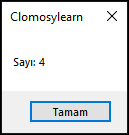
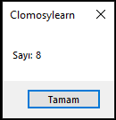
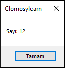
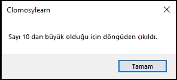

# 6.Bölüm 3.Örnek

### Açıklama

Örnekte, `Sayi` adında bir tamsayı değişkeni tanımlanmış ve bir `repeat-until` döngüsü kullanılmıştır. `Sayi` başlangıçta **0** olarak atanmıştır. Döngü her iterasyonda `Sayi` değerine 4 ekler ve "Sayı: [güncel değer]" mesajını ekrana yazdırır. Döngü, `Sayi` değeri **10'dan büyük** olduğunda sonlanır. Döngü tamamlandığında, "Sayı 10'dan büyük olduğu için döngüden çıkıldı." mesajı görüntülenir.

