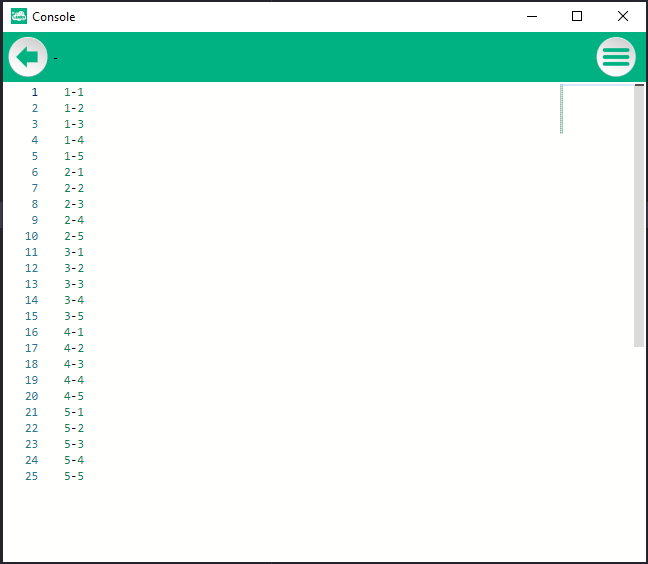

# 6.Bölüm 4.Örnek

### Açıklama

Örnekte, `Satir` ve `Sutun` adında iki tamsayı değişkeni tanımlanmış ve iç içe iki `for` döngüsü kullanılarak bir işlem gerçekleştirilmiştir. Dış döngü, `Satir` değişkenini 1'den 5'e kadar sıralar, her bir `Satir` değeri için iç döngü çalıştırılarak `Sutun` değişkeni de 1'den 5'e kadar sıralanır. Döngü sırasında `Satir` ve `Sutun` değerleri birleştirilip "Satir-Sutun" formatında `Console.Text` ile ekrana yazdırılmaktadır.

