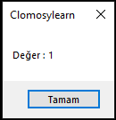
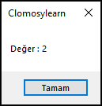
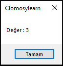
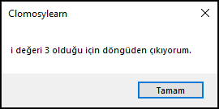
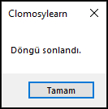

# 6.Bölüm 5.Örnek

### Açıklama

Örnekte, `i` adında bir tamsayı değişkeni tanımlanmış ve bir `for` döngüsü kullanılmıştır. Döngü, `i` değeri 1'den 10'a kadar artarak devam eder. Her iterasyonda, `i` değeri ekrana yazdırılır. Ancak, `i` değeri **3** olduğunda, `Break` komutu ile döngüden çıkılır ve "i değeri 3 olduğu için döngüden çıkıyorum." mesajı görüntülenir. Döngü sonlandıktan sonra "Döngü sonlandı." mesajı yazdırılır.

