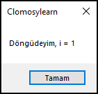
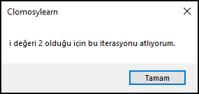
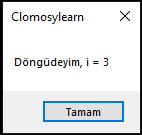
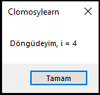

# 6.Bölüm 6.Örnek

### Açıklama

Örnekte, `i` adında bir tamsayı değişkeni tanımlanmış ve bir `for` döngüsü kullanılmıştır. Döngü, `i` değeri 1'den 4'e kadar artarak devam eder. Eğer `i` değeri **2** olduğunda, `Continue` komutu çalıştırılır ve "i değeri 2 olduğu için bu iterasyonu atlıyorum." mesajı ekrana yazdırılır. `Continue` komutundan sonra döngüdeki kalan işlemler atlanarak bir sonraki iterasyona geçilir. Diğer `i` değerleri için ise "Döngüdeyim, i = [değer]" mesajı ekrana yazdırılır.

