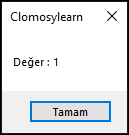
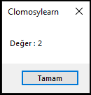
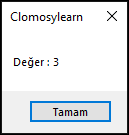
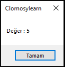
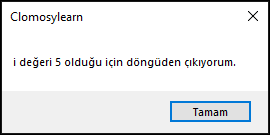

# 6.Bölüm 7.Örnek

### Açıklama

Örnekte, `i` adında bir tamsayı değişkeni tanımlanmış ve bir `for` döngüsü kullanılmıştır. Döngü, `i` değeri 1'den 10'a kadar artarak devam eder. Her iterasyonda, `i` değeri ekrana yazdırılır. Ancak, `i` değeri **5** olduğunda, `Exit` komutu çalıştırılır ve "i değeri 5 olduğu için döngüden çıkıyorum." mesajı ekrana yazdırılır. `Exit` komutu, döngüyü ve ardından gelen tüm kodu sonlandırır. Bu nedenle "Döngü sonlandı." mesajı ekrana yazdırılmadan önce döngü sona erer. 

