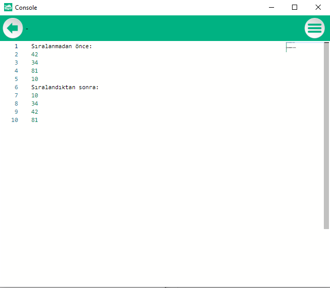

# 7.Bölüm 3.Örnek

### Açıklama

Örnekte, `Dizi` adında 4 elemanlı bir tamsayı dizisi tanımlanmış ve başlangıçta bazı değerlerle doldurulmuştur. İlk olarak, dizinin sıralanmamış hali ekrana yazdırılmaktadır. Ardından, seçim sıralama algoritması kullanılarak dizinin elemanları küçükten büyüğe sıralanır. Bu algoritmada, her adımda sıralanmamış bölümdeki en küçük eleman bulunur ve bu eleman, sıralanmış bölümün son elemanıyla yer değiştirilir. Yer değiştirme işlemi, `Min` değişkeni ve `Tut` geçici bir değişken ile yapılır. Son olarak, sıralanmış dizi ekrana yazdırılır.

