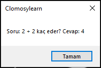
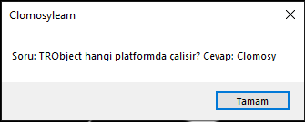
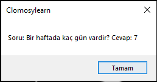

# 7.Bölüm 1.soru

### Açıklama

Soru ve cevapların beraber tutulabileceği bir dizi yapısı oluşturunuz. Bu yapıda birden fazla soru ve cevabı tutarak her birini ekranda gösterecek bir program yazınız.

