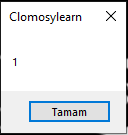
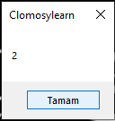
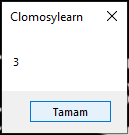

# 7.Bölüm 3.soru

### Açıklama

Bir dizi tanımlanmış ve bu dizinin elemanları bir for döngüsü kullanılarak ekrana yazdırılmak istenmiştir. Aşağıdaki kod parçasında bazı eksiklikler ve yazım hataları bulunmaktadır:

    var 
    kontrol: array[3] of Integer;
    i: integer;
    {
    kontrol = [1, 2, 3];
    for (i = 1 to length(kontrol) - 1) {
        ShowMessage(kntrol[i]);
    }
    }
Bu kod parçasındaki eksiklikleri ve hataları tespit ederek düzeltiniz. Kodun doğru ve çalışır bir hâlini sağlayınız.

### Cevap

Hatalar ve Eksiklikler:

* Yazım hatası: Döngü içinde kullanılan kntrol[i] değişken adı yanlış yazılmış, doğru olan kontrol[i] olmalıdır.
* Dizi tanımlama hatası: Dizi boyutu yanlış belirtilmiştir. Bir hata alınmaz fakat array[3] yerine array[0..2] veya benzeri bir doğru tanımlama (array[2]) yapılmalıdır. TRObject'te diziler 0 tabanlıdır.
* Döngü sınır hatası: for (i = 1 to length(kontrol) - 1) ifadesi hatalıdır. Döngü 0'dan başlamalıdır.

### NOT: Düzenlenmiş kod "code.tro" dosyası içerisindedir.

