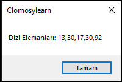
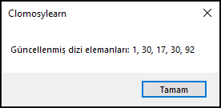

# 7.Bölüm 6.soru

### Açıklama

Tek boyutlu bir sayı dizisi oluşturunuz. Dizi, rastgele değerler içeren 5 elemandan oluşacaktır. Bu dizideki en küçük elemanı bulunuz ve bu elemanın yerine 1 değerini atayınız.

