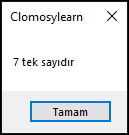

# 8.Bölüm 1.Örnek

### Açıklama

Örnekte, bir `TekmiCiftmi` prosedürü tanımlanmış ve içinde bir sayının tek mi yoksa çift mi olduğunu kontrol eden bir koşul bulunuyor. Bu kontrol, sayının 2'ye bölümünden kalan (mod) kullanılarak yapılır. Eğer kalan 0 ise sayı çift, değilse sayı tek olarak kabul edilir. `ShowMessage` komutu ile sayı ve türü ekrana yazdırılır. Prosedürün sonunda `TekmiCiftmi` çağrılarak işlem gerçekleştirilir.

