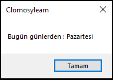
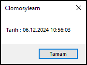

# 8.Bölüm 10.Örnek

### Açıklama

Örnekte, bir tarih değişkeni üzerinden gün hesaplama ve mevcut tarihi yazdırma işlemleri yapılmıştır. İlk olarak `EncodeDate` fonksiyonu ile belirli bir tarih oluşturulmuş ve bu tarihin haftanın hangi gününe denk geldiği `DayOfWeek` fonksiyonu ile hesaplanmıştır. Elde edilen gün sayısına göre `case` yapısı kullanılarak haftanın günü ekrana yazdırılmıştır. Ardından, `Now` fonksiyonu ile mevcut tarih ve saat alınmış, `DateTimeToStr` fonksiyonu kullanılarak ekrana yazdırılmıştır. Bu örnek, tarih ve zaman işlemlerini temel düzeyde ele almaktadır.

