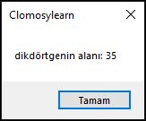

# 8.Bölüm 2.Örnek

### Açıklama

Örnekte, bir `AlanHesapla` prosedürü tanımlanmış ve dikdörtgenin alanını hesaplamak için kısa kenar ve uzun kenar girilmiştir. Alan, kısa kenar ile uzun kenarın çarpılmasıyla hesaplanır. Hesaplanan alan `ShowMessage` komutu ile ekrana yazdırılır. Prosedür çağrıldığında, dikdörtgenin alanı hesaplanarak kullanıcıya gösterilir.

