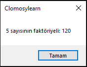

# 8.Bölüm 3.Örnek

### Açıklama

Örnekte, bir `FaktoriyelHesapla` prosedürü tanımlanmış ve verilen bir sayının faktöriyelini hesaplamak için bir `for` döngüsü kullanılmıştır. Başlangıçta `Faktoriyel` değişkeni 1 olarak belirlenir ve `Sayi` değeri 5 olarak atanır. Ardından, 1'den 5'e kadar olan sayılarla çarpılarak faktöriyel hesaplanır. Hesaplanan faktöriyel değeri `ShowMessage` komutu ile ekrana yazdırılır.

