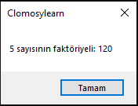

# 8.Bölüm 4.Örnek

### Açıklama

Örnekte, bir parametreli `FaktoriyelHesapla` prosedürü tanımlanmıştır. Bu prosedür, dışarıdan alınan bir sayıyı (`Sayi`) alarak faktöriyelini hesaplar. `Faktoriyel` değişkeni başlangıçta 1 olarak atanır ve verilen sayı kadar döngü çalıştırılarak faktöriyel hesaplanır. Hesaplanan sonuç, `ShowMessage` komutu ile ekrana yazdırılır.

Bu prosedür ile farklı sayılar için faktöriyel hesaplamak mümkündür. Örnekte, `FaktoriyelHesapla(5)` çağrısı yapılmıştır, bu da 5 sayısının faktöriyelini hesaplayacaktır.

