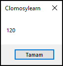

# 8.Bölüm 5.Örnek

### Açıklama

Örnekte, bir fonksiyon tanımlanmıştır: `FaktoriyelHesapla`, bu fonksiyon bir sayıyı parametre olarak alır ve faktöriyelini hesaplayarak sonucu döndürür. Fonksiyonun döndürdüğü değeri almak için `Result` anahtar kelimesi kullanılır. Burada `FaktoriyelHesapla` fonksiyonu 5 sayısının faktöriyelini hesaplamakta ve sonucu `GelenDeger` değişkenine atamaktadır.

Bu örnekle 5 faktöriyel (5!) sonucu olan `120` değeri ekrana yazdırılacaktır.

 