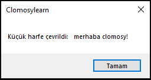
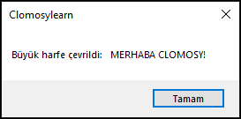
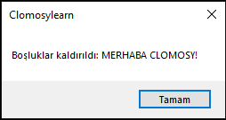
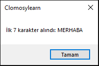
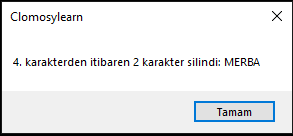
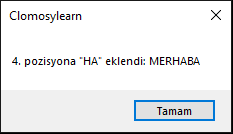
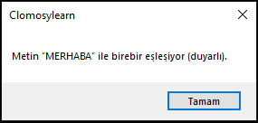
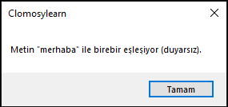

# 8.Bölüm 6.Örnek

### Açıklama

Örnekte, bir metin üzerinde gerçekleştirilebilecek çeşitli string işlemleri gösterilmektedir.
Bu işlemler, TROBject dilinde sıkça kullanılan metin yönetimi yöntemlerini içermektedir:

1. **Küçük Harfe Çevirme**: `AnsiLowerCase` fonksiyonu, tüm harfleri küçük harfe dönüştürür.  
2. **Büyük Harfe Çevirme**: `AnsiUpperCase` fonksiyonu, tüm harfleri büyük harfe dönüştürür.  
3. **Baştaki ve Sondaki Boşlukları Kaldırma**: `Trim` fonksiyonu, metnin başındaki ve sonundaki boşlukları temizler.  
4. **Kopyalama**: `Copy` fonksiyonu, belirtilen aralıktaki karakterleri seçer.  
5. **Karakter Silme**: `Delete` fonksiyonu, metinden belirli bir aralıktaki karakterleri kaldırır.  
6. **Metin Ekleme**: `Insert` fonksiyonu, metnin belirli bir pozisyonuna yeni bir metin ekler.  
7. **Metin Karşılaştırma (Duyarlı)**: `AnsiCompareStr`, büyük-küçük harf duyarlı bir karşılaştırma yapar.  
8. **Metin Karşılaştırma (Duyarsız)**: `AnsiCompareText`, büyük-küçük harf duyarsız bir karşılaştırma yapar.

Bu işlemlerin her biri, string manipülasyonu ve veri işleme süreçlerinde faydalı ve pratiktir.
Özellikle kullanıcı girdilerinin düzenlenmesi veya doğrulanması gibi durumlarda sıklıkla kullanılır.

