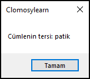

# 8.Bölüm 7.Örnek

### Açıklama

Örnekte, bir metin tersine çevrilerek sonucu döndüren bir fonksiyon yazılmıştır. **TersCevir** adlı bu fonksiyon, parametre olarak aldığı metnin son karakterinden başlayarak ilk karakterine kadar tüm harflerini birleştirerek ters bir metin oluşturur. Kodun sonunda, "kitap" kelimesi bu fonksiyona gönderilir ve elde edilen ters metin (patik) ekrana yazdırılır. 

