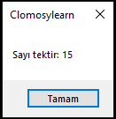
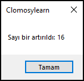
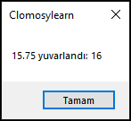
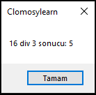
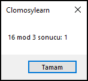
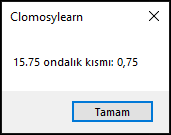
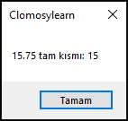

# 8.Bölüm 8.Örnek

### Açıklama

Örnekte, **sayısal işlemler** üzerinde çeşitli temel yöntemlerin nasıl kullanıldığını açıklayan bir kod yer almaktadır. Bu örnekte, bir tam sayının tek veya çift olup olmadığını kontrol etme, bir sayıyı artırma, yuvarlama, tam sayı bölme, mod alma (kalan bulma), ondalık kısmı ve tam kısmı elde etme gibi işlemler gerçekleştirilmiştir.

