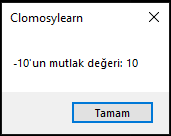

# 8.Bölüm 9.Örnek

### Açıklama

Örnekte, **matematiksel işlemler ve fonksiyonların** TRObject'e nasıl kullanılabileceği gösterilmektedir. Kod, sayısal manipülasyonlar ve özel matematik fonksiyonları içeren dört temel soruyu ele almaktadır:
 
* `Dec` fonksiyonu kullanılarak, bir tam sayı bir birim azaltılmıştır. Örnekte, başlangıç değeri `5` olan `z` değişkeni, `Dec(z)` ile `4` olmuştur.

* `Sqrt` fonksiyonu, verilen bir sayının karekökünü döndürür. Örnekte, `25` sayısının karekökü `5` olarak hesaplanmıştır.

* `Abs` fonksiyonu, negatif bir sayının pozitif eşdeğerini döndürür. Örnekte, `-10` sayısının mutlak değeri `10` olarak hesaplanmıştır.

* `Random` fonksiyonu, 0 ile 1 arasında bir rastgele sayı üretir. Örnekte, bu sayı `20` ile çarpılarak, 0 ile 20 arasında bir değer elde edilmiştir.

