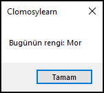

# 8.Bölüm 1.soru

### Açıklama

Bir prosedür yazınız. Bu prosedürün adı RenkSecici olsun. Prosedür, rastgele bir renk (Kırmızı, Mavi, Yeşil, Mor, Sarı, Turuncu, Kahverengi, Pembe) seçerek ekrana şu formatta bir mesaj yazdırsın:

 "Bugünün rengi: [Renk]" 

Örnek çıktı:

