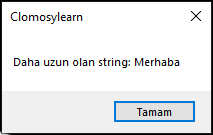

# 8.Bölüm 2.soru

### Açıklama

Bir fonksiyon yazınız. Fonksiyonun adı UzunlukKarsilastir olsun. Bu fonksiyon, iki string parametresi almalı ve uzunluğu daha fazla olan string'i geri döndürmelidir. Eğer iki string'in uzunluğu eşitse ekrana eşitliği belli eden bir geri dönüş sağlayınız.

