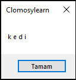

# 8.Bölüm 3.soru

### Açıklama

Kullanıcıdan bir kelime alınız ve bu kelimenin her harfi arasına bir boşluk ekleyiniz. Insert fonksiyonunu kullanarak her harf arasına bir boşluk ekleyiniz.

Örnek:

    "Girdi: kedi"
    "Çıktı: k e d i"

