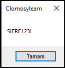

# 8.Bölüm 4.soru

### Açıklama

Bir parola belirleyiniz ve Insert ve AnsiUpperCase fonksiyonlarını kullanarak aşağıdaki işlemleri yapınız:

* Parolanın sonuna "!" ekleyiniz.
* Parolanın tamamını büyük harfe çeviriniz.
* Sonucu ekrana yazdırınız.

