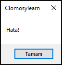

# 9.Bölüm 1.Örnek

### Açıklama

Örnekte, bir bölme işlemi sırasında oluşabilecek hataları yakalamak için `try-except` yapısı kullanılmıştır. Kodda, `y` değişkeni 15 olarak atanmış, ancak `x` değişkeni sıfır olarak atanmıştır. Ardından `y div x` işlemi gerçekleştirilmek istenmiştir. Sıfıra bölme hatası oluştuğunda, `except` bloğu devreye girmiş ve "Hata!" mesajı gösterilmiştir. Bu yapı, hata yönetimi için kullanılır ve özellikle beklenmeyen durumlarda uygulamanın çökmesini engelleyerek kullanıcıya bilgi verir.

