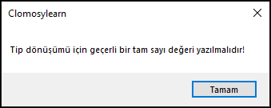

# 9.Bölüm 2.Örnek

### Açıklama

Örnekte, bir string değeri olan `Deger` değişkeni `StrToInt` fonksiyonu ile tam sayıya dönüştürülmek istenmiştir. Ancak, `Deger` değişkeni `'15b16'` değerini taşıyor, bu da geçerli bir tam sayı formatı değildir. Bu nedenle, `StrToInt` fonksiyonu bir hata oluşturur ve `except` bloğu devreye girer. Bu durumda, "Tip dönüşümü için geçerli bir tam sayı değeri yazılmalıdır!" mesajı kullanıcıya gösterilir.

