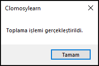
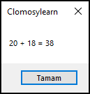

# 9.Bölüm 3.Örnek

### Açıklama

Örnekte, iki tamsayı değeri olan `Sayi` ve `Sayi2` toplanarak `Toplam` değişkenine atanmıştır. `try` bloğunda toplama işlemi gerçekleştirilirken, `finally` bloğu her durumda çalışarak "Toplama işlemi gerçekleştirildi." mesajını kullanıcıya gösterir. Ayrıca, toplam sonucu da ekranda gösterilir. `finally` bloğu, hata olsa da olmasa da her durumda çalışır ve işlem tamamlandığında yapılması gereken temizleme veya bildirim işlemleri için kullanılır.

